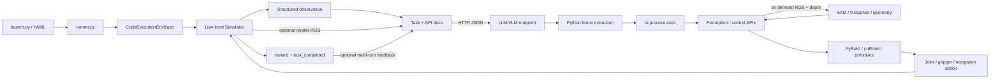
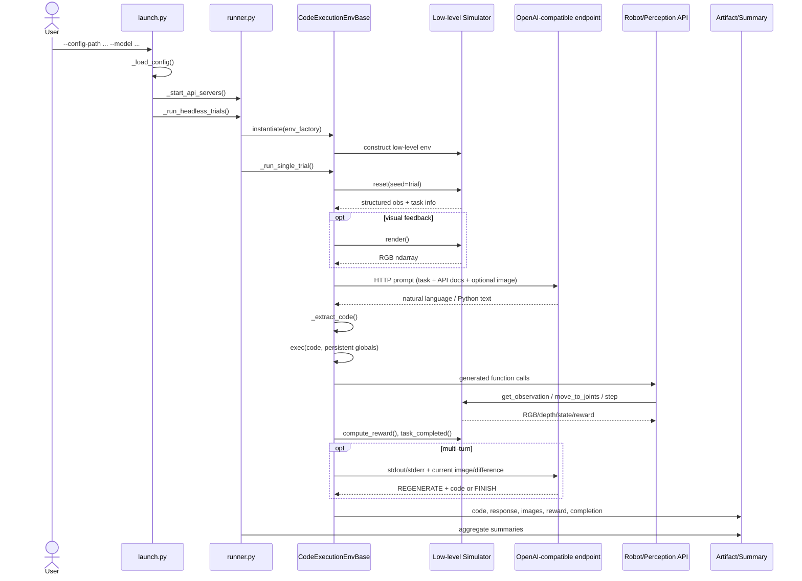
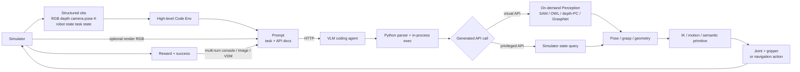

# CaP-X Repository Architecture

> 調査対象: リポジトリ内の実装・YAML・起動スクリプト・依存定義（2026-09-01時点）  
> 方針: README の記述だけでなく、実際の import、`_target_`、呼び出し元・呼び出し先を追跡した。行番号は本調査時点のもの。

## 1. プロジェクト全体像

CaP-X は、ロボット操作タスクを **Pythonコード生成問題** として解く Code-as-Policy の評価・改善基盤である。Benchmark はタスク、Simulator、VLMへのPrompt、コードから呼べるRobot API、試行数やmulti-turn条件をYAMLで組み合わせる。VLMは低レベルaction vectorを直接返さず、公開されたperception/control primitiveを組み合わせるPythonコードを生成する。そのコードを高レベルGym環境が同一プロセスで実行し、APIがSimulatorを進め、Simulator固有のreward/success判定を集計する。

READMEが示す製品上の区分は CaP-Gym（環境）、CaP-Bench（評価条件）、CaP-Agent0（multi-turn、visual differencing、skill library、ensemble）、CaP-RL（GRPO学習）である（`README.md:L24-L35`）。実装上はこれらが独立サービスとして分離されているわけではなく、主に以下へ対応する。

| 概念 | 実装上の主な所在 | 実体 |
|---|---|---|
| Benchmark / Task | `env_configs/`, `capx/envs/tasks/` | YAMLがTask class、low-level env、公開API、Prompt、trial条件を結合 |
| Simulator | `capx/envs/simulators/` | Gymnasium `BaseEnv`実装。Robosuite、LIBERO、OmniGibson/BEHAVIOR、実機bridge |
| VLM / coding agent | `capx/llm/client.py`, `capx/envs/trial.py` | OpenAI-compatible HTTP endpointへPromptを送りPythonコードを取得 |
| Perception | `capx/integrations/vision/`, control API内部 | SAM3/SAM2/OWL-ViT/Molmo/Contact-GraspNet。生成コードからオンデマンドに呼ばれる |
| Policy / Agent | `CodeExecutionEnvBase` + VLM生成コード | 固定の学習済みpolicy classではなく、生成Pythonプログラムがpolicy |
| Action execution | `capx/integrations/{franka,r1pro}/`, simulator methods | Pose/skill API → IK/plan → joint/gripper action → backend step |
| Evaluation | simulatorの`compute_reward()`/`task_completed()`、`trial.py` | reward、task completion、コード実行成否、multi-turn回数を保存・集計 |

### 1.1 実装に即した典型フロー



重要なのは、概念的な `Simulator → Perception → VLM` が常に直列ではない点である。

- 初回VLM Promptの本体はTask文と公開APIのdocstringである。`CodeExecutionEnvBase._get_complete_prompt()`がAPI docsを連結する（`capx/envs/tasks/base.py:L139-L151`）。
- visual feedback有効時だけ、Simulatorの`render()`結果をPNG data URLにしてVLM Promptへ追加する（`capx/envs/trial.py:L214-L289`, `capx/utils/launch_utils.py:L325-L373`）。
- RGB/Depth/Segmentation/Point Cloudを使う専用Perceptionは、VLMが生成したコード中の`get_object_pose()`や`sample_grasp_pose()`が実行された時に初めて動く。結果は通常、その実行中のPython変数として次のcontrol primitiveへ渡り、初回VLMへ構造化perception結果を先に渡す構成ではない（`capx/integrations/franka/control.py:L139-L277`, `L279-L415`）。
- multi-turnではstdout/stderr、現在画像、または別VLMによるimage/video differencing記述を次のVLM問い合わせへ加える（`capx/envs/trial.py:L540-L620`）。

### 1.2 レイヤ境界

```text
YAML Benchmark configuration
└── High-level CodeExecutionEnvBase (Python string action space)
    ├── Prompt owner: task class / YAML
    ├── API registry: generated codeに公開するfunctions
    └── Low-level BaseEnv (simulator-specific structured observation/action)
        └── Robosuite / LIBERO / OmniGibson / real robot bridge
```

高レベル環境の`action_space`は`spaces.Text`であり、actionはPythonコード文字列である（`capx/envs/tasks/base.py:L91-L104`）。一方、low-level `BaseEnv.step()`はjoint position等のSimulator actionを想定する（`capx/envs/base.py:L11-L48`）。この二段構造がCaP-Xの中心である。

## 2. ディレクトリ・主要ファイル構成

| Path | Role | Main classes/functions | Called from / Used by |
|---|---|---|---|
| `capx/envs/launch.py` | 評価CLI、Web/Headless分岐 | `LaunchArgs`, `main()` | README・shell scriptから直接起動 |
| `capx/utils/launch_utils.py` | YAML/CLI merge、Prompt補助、artifact/summary保存 | `_load_config()`, `_extract_code()`, `_save_trial_artifacts()` | `launch.py`, `trial.py`, `runner.py` |
| `capx/envs/runner.py` | trial orchestration、worker、retry、timeout、API server lifecycle | `_run_headless_trials()`, `_worker_setup()`, `_run_trial_with_retries()` | `launch.main()` |
| `capx/envs/trial.py` | 1 trialのVLM query→code実行→multi-turn→評価 | `_run_single_trial()`, `_query_initial_code()`, `_handle_multi_turn_step()` | `runner.py`, Web runner |
| `capx/envs/configs/loader.py` | YAMLをOmegaConf経由でdict化 | `DictLoader.load()` | `_load_config()`, low-level env構築 |
| `capx/envs/configs/instantiate.py` | Hydra風`_target_`の再帰import/生成 | `locate()`, `instantiate()` | runner、API server process、YAML env生成 |
| `capx/envs/base.py` | low-level Gym抽象とregistry | `BaseEnv`, `register_env()`, `get_env()` | 全Simulator、高レベルenv |
| `capx/envs/tasks/base.py` | code actionを実行する高レベルGym環境 | `CodeExecEnvConfig`, `CodeExecutionEnvBase` | 全Task class、runner、RL reward |
| `capx/envs/tasks/franka/` | Franka系Task Promptとoracle code | `FrankaPickPlaceCodeEnv`等 | YAMLの`env._target_` |
| `capx/envs/tasks/r1pro/` | R1Pro/BEHAVIOR Task Prompt | `R1ProBehaviorCodeEnv`等 | R1Pro YAML |
| `capx/envs/simulators/robosuite_base.py` | 単腕Robosuite共通camera/control/video層 | `RobosuiteBaseEnv` | cube/lift/restack/wipe/nut env |
| `capx/envs/simulators/robosuite_*.py` | Robosuite task backend | 各`BaseEnv`実装 | registryまたはYAML |
| `capx/envs/simulators/libero.py` | LIBERO-PRO/MuJoCo wrapper | `FrankaLiberoEnv`, `FrankaLiberoTask` | LIBERO YAML |
| `capx/envs/simulators/r1pro_b1k.py` | OmniGibson/BEHAVIOR R1Pro wrapper | `R1ProBehaviourLowLevel` | BEHAVIOR YAML |
| `capx/envs/simulators/franka_real.py` | 実機観測/action TCP bridge | `FrankaRealLowLevel`, `RepackObsAdapter` | real YAML |
| `capx/integrations/base_api.py` | 生成コードへ公開するAPI抽象・doc生成・registry | `ApiBase`, `combined_doc()`, `register_api()` | `CodeExecutionEnvBase` |
| `capx/integrations/__init__.py` | API名→factory登録 | `register_api(...)`群 | package import時 |
| `capx/integrations/franka/control.py` | 代表的な視覚ベースFranka skill API | `get_object_pose()`, `sample_grasp_pose()`, `goto_pose()` | 生成コード |
| `capx/integrations/franka/*privileged.py` | Simulator stateを直接使う上位API | task別API classes | privileged benchmark tier |
| `capx/integrations/franka/*reduced*.py` | より低い抽象度のperception/IK/joint API | `segment_*`, `solve_ik`, `move_to_joints` | reduced API tier |
| `capx/integrations/franka/*skill_library.py` | 再利用skillを追加したAPI variant | task/skill functions | skill-library config |
| `capx/integrations/r1pro/control.py` | R1Proの認識・navigation・双腕skill | `R1ProControlApi` | R1Pro生成コード |
| `capx/integrations/vision/` | model server client | `init_sam3()`, `init_contact_graspnet()`等 | control API初期化時 |
| `capx/integrations/motion/` | PyRoKi/cuRobo client・local snippets | `init_pyroki()`, `init_curobo()` | control API |
| `capx/serving/launch_*_server.py` | FastAPI perception/motion servers | `/segment`, `/plan`, `/ik`等 | YAML auto-launch / manual launcher |
| `capx/serving/launch_servers.py` | 複数serverのGPU割当・subprocess起動 | `SERVER_REGISTRY`, `start_server()` | manual pre-launch |
| `capx/serving/openrouter_server.py` | OpenRouterへのOpenAI-compatible local proxy | `/chat/completions`, `/health` | LLM client |
| `capx/serving/vllm_server.py` | vLLM OpenAI server subprocess wrapper | `_build_command()`, `main()` | local OSS VLM setup |
| `capx/llm/client.py` | model別payload、HTTP query、streaming/ensemble | `query_model()`, `query_model_ensemble()` | `trial.py`, Web runner |
| `env_configs/` | 実行可能Benchmarkのcomposition root | `env`, `api_servers`, Prompt、trial settings | `--config-path` |
| `capx/web/` + `web-ui/` | interactive execution UI、session/WebSocket | `create_app()`, `SessionManager` | `launch.py --web-ui` |
| `capx/utils/parallel_eval.py` | spawn worker + queueによる並列trial | `run_parallel_with_setup()` | `runner.py`, dataset生成 |
| `capx/skills/` | 生成コードからskill抽出・永続化 | `SkillLibrary` | opt-in `evolve_skill_library` |
| `capx/cli/prepare_verl_dataset.py` | CaP-RL用Parquet生成 | `main()`, `_generate_rows()` | training script |
| `verl_agent_reward/` | VeRLからSimulatorを呼ぶcustom reward | `compute_score()` | VeRL/GRPO |
| `scripts/` | server/eval、回帰試験、学習、skill compilation起動 | shell/Python scripts | operator |
| `capx/third_party/` | Simulator・学習・model実装submodule | Robosuite, LIBERO-PRO, b1k, VeRL, SAM3等 | `pyproject.toml` path sources |

### 2.1 構成のcomposition

`_load_config()`はYAMLの`env`を未生成のfactoryとして保持し、CLI overrideとtrial設定だけをmergeする（`capx/utils/launch_utils.py:L81-L162`）。workerごとの`instantiate(env_factory)`が`_target_`をimportし、Task → `CodeExecEnvConfig` → inline low-level Simulatorを再帰生成する（`capx/envs/runner.py:L172-L180`, `capx/envs/configs/instantiate.py:L151-L204`）。文字列low-level名の場合はregistryの`get_env()`へ解決される（`capx/envs/tasks/base.py:L207-L225`）。

例としてcube stack YAMLは次を結合する（`env_configs/cube_stack/franka_robosuite_cube_stack.yaml:L3-L33`）。

```text
FrankaPickPlaceCodeEnv
└── CodeExecEnvConfig
    ├── low_level = franka_robosuite_cubes_low_level
    ├── API = FrankaControlApi
    └── class default Prompt

Auto-launched services: SAM3:8114, Contact-GraspNet:8115, PyRoKi:8116
Trials: 100, workers: 12
```

### 2.2 Promptの所有者

- Task固有のdefault Prompt/oracle codeはTask class moduleに置く。cube stackの例は`capx/envs/tasks/franka/franka_pick_place.py:L3-L56`。
- YAMLの`cfg.prompt`がclass defaultより優先される（`capx/envs/tasks/base.py:L106-L121`）。multi-turn variantはYAMLで`multi_turn_prompt`を追加する（`env_configs/cube_stack/franka_robosuite_cube_stack_multiturn_vdm.yaml:L11-L34`）。
- LIBERO generic classはPromptをhardcodeせず、YAMLにTask goal placeholderを置く（`capx/envs/tasks/franka/franka_libero_env.py:L455-L469`, `env_configs/libero/franka_libero_spatial_0.yaml:L17-L40`）。reset後にLIBEROのlanguage goalでplaceholderを置換する（`capx/envs/trial.py:L659-L660`, `_patch_libero_goal()` at `capx/envs/trial.py:L962`）。
- API signature/docstringは`ApiBase.combined_doc()`が収集し、Promptの`APIs:`節になる（`capx/integrations/base_api.py:L92-L121`, `capx/envs/tasks/base.py:L139-L151`）。

## 3. 実行フロー

### 3.1 CLIから1 trial完了まで



段階ごとの具体的な入出力は以下の通り。

| Stage | Code | Input | Output / next |
|---|---|---|---|
| CLI parse | `launch.main()` (`capx/envs/launch.py:L203-L226`) | `LaunchArgs` | YAML load、API server起動、Web/Headless分岐 |
| Config | `_load_config()` (`capx/utils/launch_utils.py:L81-L162`) | YAML path + CLI | `env_factory`, merged config, `api_servers` |
| Server bringup | `_start_api_servers()` (`capx/envs/runner.py:L47-L88`) | `_target_`, host, port | spawn process。既存portならskip、TCP ready待ち |
| Worker | `_run_headless_trials()` (`capx/envs/runner.py:L122-L160`) | trial IDs | sequentialまたはspawn workers |
| Env creation | `_worker_setup()` / `instantiate()` | nested `_target_` config | Task + low-level env + API instances |
| Reset | `_run_single_trial()` (`capx/envs/trial.py:L629-L706`) | `seed=trial`, `options={trial}` | obs、Prompt、optional initial image |
| VLM inference | `_query_initial_code()` (`capx/envs/trial.py:L469-L498`) | `obs["full_prompt"]` | response content/reasoning/ensemble metadata |
| HTTP transport | `query_model()` (`capx/llm/client.py:L180-L283`) | model別JSON payload | response text。chat completionsまたはResponses形式 |
| Parse | `_extract_code()` (`capx/utils/launch_utils.py:L165-L189`) | raw response | fenced block内、または全文を1 code blockとして扱う |
| Execute | `CodeExecutionEnvBase.step()` (`capx/envs/tasks/base.py:L263-L298`) | Python string | `exec`結果、最新obs、reward、terminated/truncated、stdout/stderr |
| Robot action | generated call → API → low-level env | object name/pose/joints | simulator-specific step/action |
| Multi-turn | `_handle_multi_turn_step()` (`capx/envs/trial.py:L505-L622`) | executed code、console、visual feedback | `regenerate`または`finish` |
| Evaluate | low-level `compute_reward()` / `task_completed()` | current simulator state | scalar reward + bool completion |
| Persist | `_save_trial_artifacts()` (`capx/utils/launch_utils.py:L376-L460`) | code/log/images/metrics | trial directory |
| Aggregate | `_print_and_save_summary()` (`capx/utils/launch_utils.py:L464-L560`) | `TrialSummary[]` | success rate、average reward、completion等 |

### 3.2 代表例: Robosuite cube stack

1. `env_configs/cube_stack/franka_robosuite_cube_stack.yaml`が`FrankaPickPlaceCodeEnv`、`franka_robosuite_cubes_low_level`、`FrankaControlApi`を指定する（`L3-L10`）。
2. registryが文字列low-level名を`FrankaRobosuiteCubesLowLevel`へ解決する（`capx/envs/simulators/__init__.py:L20-L23`）。
3. low-level envはRobosuite `Stack(robots=["Panda"])`を生成し、camera depthを有効にする（`capx/envs/simulators/robosuite_cubes.py:L51-L100`）。
4. resetはSimulatorをreset/settleし、`get_observation()`でcube poses、camera情報、robot joint/cartesian stateを返す（同`L119-L154`, `L191-L219`）。
5. Task Promptにはcube stack goalと`FrankaControlApi`の公開5〜6関数のdocが入る（`capx/envs/tasks/franka/franka_pick_place.py:L3-L56`, `capx/integrations/franka/control.py:L89-L101`）。
6. VLM生成コード例は`sample_grasp_pose("red cube")` → `goto_pose(...)` → `close_gripper()` → placement → `open_gripper()`というhigh-level skill sequenceになる。
7. `sample_grasp_pose()`は観測RGB/depthを取り、SAM3 maskとContact-GraspNet候補を使いcamera frameのgraspをrobot base frameへ変換する（`capx/integrations/franka/control.py:L279-L415`）。
8. `goto_pose()`はTCP offsetを反映し、PyRoKi `/ik`へ送り、得た7 jointsを`move_to_joints_blocking()`へ渡す（`capx/integrations/franka/control.py:L417-L500`, `capx/integrations/motion/pyroki.py:L15-L48`）。
9. Robosuite baseはjoint+gripperをaction arrayへ変換し、`robosuite_env.step()`を繰り返す（`capx/envs/simulators/robosuite_base.py:L122-L208`）。
10. rewardはRobosuite `reward(action=None)`、completionは`_check_success()`である（`capx/envs/simulators/robosuite_cubes.py:L191-L197`）。

### 3.3 Multi-turn / visual differencing

`_run_single_trial()`は1回目のコードを実行後、`multi_turn_prompt`が存在すれば各turnで判断用VLM queryを行う（`capx/envs/trial.py:L780-L864`）。

- console feedback: 実行済みコード、stdout、stderrをYAML templateへformat。
- visual feedback: 現在のmain camera、任意でwrist camera。
- image differencing: 前後2画像を別VLMに渡し、変化のテキスト記述を得る（`capx/envs/trial.py:L332-L386`）。
- video differencing: turn内のsubsampled framesをvideo data URLとして別VLMへ渡す（`capx/envs/trial.py:L393-L462`）。
- decision parser: responseに`REGENERATE`が含まれれば後続code blockを置換し、それ以外は`finish`扱いになる（`capx/utils/launch_utils.py:L310-L322`）。明示的な`CONTINUE` branchは現実装にはない。
- visual differencingはperception model server（SAM等）ではなく、通常のVLM query pathを再利用する。

### 3.4 コード実行の境界とvalidation

`CodeExecutionEnvBase._exec_user_code()`はpersistent globalsへ`obs`, `env`, `APIS`と各公開関数をbindし、組み込み`exec()`を呼ぶ（`capx/envs/tasks/base.py:L153-L205`）。従って、コードは別sandbox/containerではなく評価workerと同一Pythonプロセスで動き、installed packageのimportも許可される。`sandbox_rc`というmetric名は成功/例外を表すだけで、OS-level sandboxを意味しない。

実装上確認できるvalidation/safetyは限定的である。

- code fence抽出とexception capture、stdout/stderr記録。
- trial全体のSIGALRM timeoutと最大3 retry（`capx/envs/runner.py:L195-L216`, `L274-L316`）。
- API内部のshape変換、IK convergence、joint tolerance、step上限。
- 実機bridgeにも任意コード自体を制限するallowlistやAST validationは確認できない。

## 4. ローカルネットワーク・プロセス間通信

### 4.1 通信一覧

| Source | Destination | Protocol | Default port | Purpose | Related code |
|---|---|---:|---:|---|---|
| trial worker | LLM proxy / model server | HTTP JSON, OpenAI-compatible | 8110 in `LaunchArgs`; proxy `main()` default is 8111 | code generation、VDM | `capx/envs/launch.py:L49-L89`, `capx/llm/client.py:L180-L283` |
| OpenRouter proxy | OpenRouter | HTTPS via OpenAI SDK | external | provider forwarding | `capx/serving/openrouter_server.py:L73-L181` |
| trial worker | vLLM server | HTTP OpenAI API | 8000 | local model inference | `capx/serving/vllm_server.py:L12-L49` |
| Franka/R1Pro API | SAM3 | HTTP POST `/segment`, `/segment_point` | 8114 | text/point prompt segmentation | `capx/integrations/vision/sam3.py:L20-L84`, `L185-L214` |
| Franka/LIBERO API | Contact-GraspNet | HTTP POST `/plan`, `/plan_point_clouds` | 8115 | grasp candidates | `capx/integrations/vision/graspnet.py:L116-L218` |
| Robot API | PyRoKi | HTTP POST `/ik`, `/plan` | 8116 | IK / trajectory | `capx/integrations/motion/pyroki.py:L12-L76` |
| reduced API | SAM2 | HTTP POST `/segment`, `/segment_point` | 8113 | mask inference | `capx/integrations/vision/sam2.py:L17`, server endpoints `capx/serving/launch_sam2_server.py:L229-L345` |
| reduced API | OWL-ViT | HTTP POST `/detect` | client/server main 8117 | open-vocabulary detection | `capx/integrations/vision/owlvit.py:L16-L81` |
| motion API | cuRobo | HTTP POST `/ik`, `/plan`, `/motion_plan` | 8117 | GPU IK/motion planning | `capx/integrations/motion/curobo.py:L10-L68`, `capx/serving/launch_curobo_server.py:L343-L387` |
| skill-library API | Molmo/vLLM | HTTP OpenAI-compatible | 8122 | visual point grounding | `capx/integrations/vision/molmo.py:L20`, `L146-L168` |
| real robot client | `FrankaRealLowLevel` | framed TCP: 4-byte length + msgpack-numpy | 9000 | observation upload / latest action response | `capx/envs/simulators/franka_real.py:L99-L170`, `capx/utils/msgpack_server_client_utils.py:L9-L78` |
| browser | CaP-X Web backend | HTTP + WebSocket | 8200 | config/session/control/event stream | `capx/envs/launch.py:L186-L196`, `capx/web/server.py:L179-L420` |
| Web backend | Viser | HTTP + WebSocket proxy | discovered from 8080+ | 3D debug UI proxy | `capx/web/server.py:L50-L68`, `L428-L539` |

注意点:

- README例はOpenRouter proxyを`--port 8110`で起動するため`LaunchArgs` defaultと一致するが、`openrouter_server.main()`自身のdefaultは8111である（`README.md` Quick Start、`capx/serving/openrouter_server.py:L184-L203`）。operatorは明示portを使う必要がある。
- OWL-ViT client/server mainとcuRoboはともに8117をdefaultにしており、同時起動すると衝突する。さらにunified launcher registryはOWL-ViT defaultを8118とする一方、`full` profileは8117を指定する（`capx/serving/launch_servers.py:L71-L115`）。client URLは固定8117なので、port overrideだけではclient側も合わせる仕組みがない。この組合せの整合性は現コードから確認できず、運用時の注意点である。

### 4.2 process model

- YAML `api_servers`は`multiprocessing.get_context("spawn").Process(target=instantiate, ...)`で評価プロセスの子として起動される（`capx/utils/launch_utils.py:L48-L78`）。runnerはportが既にlisten中なら外部起動済みとみなしてskipする（`capx/envs/runner.py:L47-L88`）。
- trial並列化はspawn contextのworker processとQueueを使い、workerごとにSimulatorとAPI clientを一度生成してtrial間で再利用する（`capx/envs/runner.py:L147-L180`, `capx/utils/parallel_eval.py:L227-L275`）。
- `launch_servers.py`は別のmanual pre-launch経路で、`nvidia-smi`を読みGPU memoryをgreedy allocationし、各serverを`subprocess.Popen`する（`capx/serving/launch_servers.py:L134-L223`, `L300-L379`）。
- `vllm_server.py`も`python -m vllm.entrypoints.openai.api_server`をsubprocessとして起動する（`capx/serving/vllm_server.py:L27-L84`）。
- Simulator自体はRobosuite/LIBERO/OmniGibsonとも通常はtrial worker内のPython objectであり、Simulator serverへのHTTP/gRPC通信はない。例外は実機bridgeのTCP serverである。
- ROS/ROS2、gRPC、UDPの使用はCaP-X本体（`capx/`, `scripts/`, `env_configs/`。third-party除外）の検索では確認できない。

### 4.3 Docker

CaP-X本体にDockerfileまたはComposeによるservice orchestrationは確認できない。Dockerfileは`capx/third_party/b1k/OmniGibson/docker/`、`capx/third_party/curobo/docker/`、`capx/third_party/verl/docker/`等、vendored upstream内に存在する。通常のCaP-X起動はローカルPython process間通信であり、コンテナ間networkを前提にしていない。

## 5. シミュレーション環境

### 5.1 対応backend

| Simulator / target | Benchmark / Task | Package / backend | GPU usage | Headless | GUI / Notes |
|---|---|---|---|---|---|
| Robosuite | cube lifting、cube stack、cube restack、spill wipe、nut assembly、two-arm handover、two-arm lift | vendored `robosuite`, MuJoCo | physicsは主にCPU。EGL offscreen renderでGPUを利用可能 | Yes (`MUJOCO_GL=egl`) | `privileged && !enable_render`ではcamera rendererを無効化可能。通常visual tierはoffscreen camera |
| LIBERO-PRO | suites `libero_10`, `libero_90`, `libero_object`, `libero_spatial`, `libero_goal`のtask ID | vendored LIBERO-PRO +別版Robosuite/MuJoCo | Robosuiteと同様、offscreen renderでGPU利用可能 | Yes | Robosuite 1.4系との衝突のため別venvが必要 |
| BEHAVIOR / OmniGibson | R1Pro radio/trash + 多数のBEHAVIOR activity YAML | vendored b1k, OmniGibson, NVIDIA Isaac Sim | CUDA-capable NVIDIA GPUが実質必須 | Yes (`gm.HEADLESS=True`, env vars) | Isaac Sim、asset dataset、EULAが必要。mobile base + torso + dual arms |
| Real Franka | real cube manipulation demo | external robot client + msgpack TCP | camera/perception server側でGPU使用 | N/A | Simulatorではない。CaP-X側がTCP server :9000になり、実機processがclient |

根拠:

- Simulator registryはRobosuite 8 low-level名、LIBERO suitesの全task ID、R1Pro、実機を登録する（`capx/envs/simulators/__init__.py:L5-L69`）。
- RobosuiteとLIBERO extraは異なるvendored Robosuiteをpath dependencyにし、同時installを`conflicts`で禁止する（`pyproject.toml`の`[tool.uv.sources]`と`conflicts`）。
- BEHAVIOR wrapperは`omnigibson`をimportし、object states有効、GPU dynamics無効、headless有効を設定する（`capx/envs/simulators/r1pro_b1k.py:L20-L64`）。Isaac Sim自体はGPUを必要とするため、`USE_GPU_DYNAMICS=False`は「GPU不要」を意味しない。
- Robosuite共通層は`MUJOCO_GL=egl`をdefaultにする（`capx/envs/simulators/robosuite_base.py:L9-L22`）。

### 5.2 Benchmark–Simulator対応

```text
CaP-X Benchmark configs
├── Robosuite / MuJoCo
│   ├── cube_lifting       → Lift / FrankaLiftCodeEnv
│   ├── cube_stack         → Stack / FrankaPickPlaceCodeEnv
│   ├── cube_restack       → customized Stack / FrankaRestackCodeEnv
│   ├── spill_wipe         → Wipe / FrankaSpillWipeCodeEnv
│   ├── nut_assembly       → NutAssemblySquare / FrankaNutAssemblyCodeEnv
│   ├── two_arm_handover   → TwoArmHandover / TwoArmHandoverCodeEnv
│   └── two_arm_lift       → TwoArmLift / TwoArmLiftCodeEnv
├── LIBERO-PRO / MuJoCo
│   └── libero_10, libero_90, libero_object, libero_spatial, libero_goal
│       └── task_id → generic FrankaLiberoCodeEnv + FrankaLiberoEnv
├── BEHAVIOR / OmniGibson / Isaac Sim
│   ├── turning_on_radio → R1ProRadioCodeEnv
│   ├── trash pickup     → R1ProTrashCodeEnv
│   └── activity_name YAML群 → R1ProBehaviorCodeEnv
└── Real Franka
    └── real demo config → FrankaRestackCodeEnv + FrankaRealLowLevel
```

Robosuite backend classの実際の生成対象は、Lift（`capx/envs/simulators/robosuite_cube_lift.py:L49-L84`）、Stack（`capx/envs/simulators/robosuite_cubes.py:L55-L100`）、Wipe（`capx/envs/simulators/robosuite_spill_wipe.py:L50-L85`）、NutAssemblySquare（`capx/envs/simulators/robosuite_nut_assembly.py:L62-L97`）、TwoArmHandover（`capx/envs/simulators/robosuite_handover.py:L62-L101`）、TwoArmLift（`capx/envs/simulators/robosuite_two_arm_lift.py:L59-L99`）で確認できる。

### 5.3 Benchmark tier / variantの差

同一Task familyに複数YAMLがあり、主に次の軸を切り替える。

| Variant | 差分 |
|---|---|
| default visual API | natural-language object指定からPerception、grasp、IKをまとめたhigh-level API |
| `privileged` | Simulator object pose/stateを直接参照するAPI。camera/perception serverを減らせる |
| `reduced_api` | segmentation、grasp planning、IK、joint move等をより細かくVLMに組み立てさせる |
| `exampleless` | API docのexampleを減らしたPrompt条件 |
| `skill_lib` | compiled reusable skillを追加 |
| `multiturn` | stdout/stderrを見てREGENERATE/FINISH |
| `multiturn_vf` | current visual feedbackを追加 |
| `multiturn_vdm` | 別VLMによるvisual differencing記述を追加 |
| oracle YAML | `use_oracle_code`でTask class/YAMLのreference codeを実行 |

これは独立Simulatorの違いではなく、同一low-level envに対して公開API抽象度とagent interaction modeを変えるBenchmark設計である。

## 6. Simulator・VLM・Perception・Actionの接続

### 6.1 一枚のデータフロー図



### 6.2 Simulator → Observation

#### Robosuite

`RobosuiteBaseEnv._process_camera_observations()`は各cameraについて次を追加する（`capx/envs/simulators/robosuite_base.py:L222-L290`）。

- `pose`: robot base frameの`[xyz, wxyz]`
- `pose_mat`: 4×4 transform
- `intrinsics`: fovyから作る3×3 pinhole K
- `images.rgb`: vertically flipped `uint8` image
- `images.depth`: `get_real_depth_map()`でmetric depthへ変換
- `images.segmentation`: Simulatorが出したinstance mask（有効なtask/configのみ）
- `robot_joint_pos`: 7 joints + normalized gripper
- `robot_cartesian_pos`: end-effector xyz+wxyz+gripper（同`L291-L314`）

Task subclassはさらにcube poses等のprivileged stateをobsへ足す場合がある（`capx/envs/simulators/robosuite_cubes.py:L199-L219`）。

#### LIBERO

`FrankaLiberoEnv.get_observation()`は`agentview`と`robot0_eye_in_hand`の両cameraにpose、pose matrix、K、RGB、metric depth、optional segmentationを入れ、robot joint/cartesian stateを返す（`capx/envs/simulators/libero.py:L432-L516`）。backend actionは7 joint delta + 1 gripperに変換され、`LiberoHandle.step()`へ渡る（同`L212-L265`）。

#### BEHAVIOR

`R1ProBehaviourLowLevel.get_observation()`はOmniGibson `env.get_obs()`をそのまま返す。documented structureはtask low-dim、head/left wrist/right wrist RGB+depth、68次元proprioである（`capx/envs/simulators/r1pro_b1k.py:L415-L437`）。NumPyではなくTorch Tensorを含むため、R1Pro APIや`render()`で`.cpu().numpy()`変換する（同`L336-L342`）。

#### Real Franka

external clientから来るmsgpackを`RepackObsAdapter`が`robot_joint_pos`、top camera RGB/depth、K、pose/pose_matへ再構成する（`capx/envs/simulators/franka_real.py:L34-L84`）。

### 6.3 Observation → VLM

`CodeExecutionEnvBase._get_observation()`はlow-level obsへ`full_prompt`を追加する（`capx/envs/tasks/base.py:L227-L236`）。ただし`query_model()`へ送るのは`obs["full_prompt"]`であり、structured NumPy/Torch observation全体ではない（`capx/envs/trial.py:L469-L498`）。従ってrobot stateやdepth、object poseが自動的にVLM contextへserializeされるわけではない。

VLMへ実際に渡り得る情報は次である。

- system messageとTask instruction
- 公開APIのfunction signature/docstring
- YAMLに埋めたtask metadata/language goal
- `use_visual_feedback`: main camera PNG data URL、任意でwrist image
- VDM: initial scene description、前後画像差分、またはturn video description
- multi-turn: 実行済みcode、stdout、stderr
- ensemble時: 複数candidateとsynthesis Prompt

### 6.4 Perception（独立moduleとservice）

Perceptionは独立moduleとして存在するが、独立した常駐pipeline processがSimulator frameを購読する方式ではない。Robot APIの同期HTTP clientが必要時に画像/arrayをserverへPOSTするrequest/response方式である。

| Perception | Input | Output | Model/process | Main callers |
|---|---|---|---|---|
| SAM3 | PNG base64 + text/point prompt | bool mask、box、score、label | FastAPI + SAM3 GPU model | visual Franka/LIBERO/R1Pro APIs |
| OWL-ViT/OWL-v2 | PNG base64 + text labels | boxes、scores、labels | FastAPI Transformers model | non-SAM3/reduced API |
| SAM2 | image + optional box/point | masks/scores | FastAPI SAM2 model | reduced API / OWL→SAM chain |
| Molmo | image + text | 2D point grounding | local OpenAI-compatible VLM | some skill-library/LIBERO API |
| depth geometry | depth + K + RGB | camera-frame point cloud | in-process NumPy/Open3D | all visual robot APIs |
| Contact-GraspNet | depth+K+segmap、またはpoint clouds | grasp matrices、scores、contact points | FastAPI GPU model | `sample_grasp_pose()`等 |

SAM3 clientのarray→PNG base64とmask decodeは`capx/integrations/vision/sam3.py:L23-L84`、GraspNetのNumPy `.npy` base64 request/responseは`capx/integrations/vision/graspnet.py:L98-L175`にある。

### 6.5 代表的なPerception → Action変換

`FrankaControlApi.sample_grasp_pose(object_name)`の処理は次の通り。

```text
env.get_observation()
  → first RGB + robot0_robotview depth/K/camera pose
  → SAM3(text=object_name)
  → best mask/box by score
  → depth + K → point cloud (visualization/target points)
  → Contact-GraspNet(depth, K, mask, instance_id)
  → best grasp 4×4 by score
  → camera extrinsic × grasp transform
  → robot-base position + WXYZ quaternion
```

根拠は`capx/integrations/franka/control.py:L279-L415`。`get_object_pose()`の場合はmask内point cloudからOpen3D OBBを作り、camera poseと合成してobject pose/extentを返す（同`L139-L277`）。

### 6.6 VLM → Action representation

VLM outputは主に自然言語を含み得るPython source textであり、`_extract_code()`がMarkdown fenceを外す。structured JSON action schemaは使わない。生成コードは次の抽象度のいずれかを呼ぶ。

- high-level visual: `get_object_pose`, `sample_grasp_pose`, `goto_pose`, gripper open/close
- privileged: Simulator object state + pose motion
- reduced: detect/segment、OBB、grasp、IK、joint moveを個別に構成
- bimanual: arm0/arm1 joint、gripper、handover/lift primitives
- R1Pro: navigation、torso、dual-arm grasp、semantic action primitives

API function mappingだけがglobalsへbindされるのではなく、`env`と`APIS`自体も公開されるため、生成コードは理論上low-level envへ直接アクセスできる（`capx/envs/tasks/base.py:L187-L205`）。

### 6.7 Action → Simulator

#### Franka / Robosuite

`goto_pose()`はtarget poseへTCP offsetを加え、PyRoKi IKの返すconfigurationから7 arm jointsを抜き、`move_to_joints_blocking()`を呼ぶ（`capx/integrations/franka/control.py:L417-L500`）。Robosuite共通層はcurrent jointsとgripper fractionからactionを構築し、gripperを`open=1.0 → -1.0`, `closed=0.0 → +1.0`へmapしてbackend `step()`へ渡す（`capx/envs/simulators/robosuite_base.py:L114-L156`）。

#### LIBERO

target-current joint差をcontrol frequency倍した7-deltaとgripper 1値を作り、`handle.step(action)`を反復する（`capx/envs/simulators/libero.py:L212-L265`）。

#### R1Pro / OmniGibson

R1Pro APIはOmniGibsonの`StarterSemanticActionPrimitives`、IK、navigation generator等を使い、generatorが出すactionごとにlow-level `env.step(action)`する。例えばnavigationは`_navigate_to_pose()` generatorを反復する（`capx/envs/simulators/r1pro_b1k.py:L453-L471`）、motion planは`controller._execute_motion_plan(q_traj)`を反復する（同`L507-L516`）。

#### Real Franka

target joints/gripperをtimestamp付きdictにし、TCP serverの`latest_action`として繰り返しpublishする。external clientはobservationを送信するたび最新actionをresponseとして受け取る（`capx/envs/simulators/franka_real.py:L190-L233`, `capx/utils/msgpack_server_client_utils.py:L45-L55`）。

### 6.8 Evaluation

評価には区別すべき2つの成功概念がある。

- `success`: 生成コードがexceptionなし、すなわち`info_step["sandbox_rc"] == 0`（`capx/envs/trial.py:L925-L959`）。
- `task_completed`: Simulator固有success predicate。

`CodeExecutionEnvBase.step()`はlow-level `compute_reward()`と`task_completed()`を呼び、`reward == 1.0`をGym `terminated`にする（`capx/envs/tasks/base.py:L263-L298`）。Simulator例:

- Robosuite stack: dense `reward(action=None)` + `_check_success()`（`capx/envs/simulators/robosuite_cubes.py:L191-L197`）。
- LIBERO:最後のbackend reward + `env.check_success()`（`capx/envs/simulators/libero.py:L429-L430`, `L527-L529`）。
- BEHAVIOR: radio/trashはcustom lift predicate、それ以外はchallenge metricsの`q_score.final`と`info['done']['success']`（`capx/envs/simulators/r1pro_b1k.py:L344-L395`, `L842-L855`）。
- Real Franka:現実装の`compute_reward()`は常に0、`task_completed()`は常にFalseであり、自動task評価は未実装（`capx/envs/simulators/franka_real.py:L271-L283`）。

artifact directory名にはtrial、code execution rc、reward、completionが入り、`code.py`, raw response, all responses, summary, prompt、visual feedback、videosを保存する（`capx/utils/launch_utils.py:L390-L460`）。

## 7. CaP-RLと補助経路

CaP-RLは同じ高レベルcode environmentをVeRL reward functionから直接再利用する。

1. `prepare_verl_dataset.py`がTask/API Prompt、data source、seed、oracle program metadataをParquetへ書く（`capx/cli/prepare_verl_dataset.py:L41-L83`, `L115-L157`）。
2. model rolloutの`solution_str`を`verl_agent_reward/capx_franka_reward.py:compute_score()`がcodeとして抽出する。
3. data source名からregistered config/high-level envを生成・cacheし、`env.reset(seed)` → `env.step(solution_str)`を90秒制限で実行する（`verl_agent_reward/capx_franka_reward.py:L56-L113`）。
4. code成功時はrewardに最低0.1を与え、error/timeout metadataとともにVeRLへ返す。

これは通常Benchmark runnerを経由せず、同じSimulator/CodeExecutionEnvを学習reward backendとして呼ぶ別エントリーポイントである。

## 8. 確認できない点・実装上の注意

- READMEの「39 tasks」と、現リポジトリにあるLIBERO 130+対応・多数のBEHAVIOR YAMLはスコープ/時点が異なるように見える。コードから単一の公式総task数を確定できないため、本資料では実装されたsuite/familyを列挙した。
- `capx/envs/adapters/robosuite_wrapper.py`はzero observationを返すstub、`libero_wrapper.py`も薄いlegacy wrapperであり、主要YAMLの実行経路は`capx/envs/simulators/*.py`を直接使う。名前だけで主実装とは判断しないこと。
- privileged modeでcameraを無効化できるSimulatorがある一方、YAMLの`record_video`やvisual feedbackとの組合せによってrenderが必要になる。全variantが全headless/render設定で動くことは静的調査だけでは保証できない。
- `FrankaRealLowLevel.step()`は未定義ローカル変数をreturnするstubだが、通常control pathはAPIから`move_to_joints_blocking()`/`_step_once()`を直接呼ぶ。real reward/completionも未実装である（`capx/envs/simulators/franka_real.py:L183-L186`, `L271-L289`）。
- Perception/motion serverのportには前述のOWL-ViT/cuRobo不整合がある。使用configとclient constantを同時に確認する必要がある。
- 実際のGPU/GUI動作や全Simulator trialは巨大asset、CUDA、model weight、別venv、実機を必要とするため、本調査では静的call graphを中心とし、end-to-end実行確認はしていない。

## 9. 最短の読み順

初めてコードを追う場合は次の順が最短である。

1. `env_configs/cube_stack/franka_robosuite_cube_stack.yaml`
2. `capx/envs/launch.py`
3. `capx/utils/launch_utils.py:_load_config`
4. `capx/envs/runner.py:_run_headless_trials`
5. `capx/envs/trial.py:_run_single_trial`
6. `capx/envs/tasks/base.py:CodeExecutionEnvBase`
7. `capx/integrations/franka/control.py:FrankaControlApi`
8. `capx/envs/simulators/robosuite_base.py`
9. task固有Simulator (`robosuite_cubes.py`等)
10. `capx/integrations/vision/` と `capx/integrations/motion/`

この経路を理解すると、YAMLのlow-level env/API差替えによってLIBERO、BEHAVIOR、実機、privileged/reduced/multi-turn tierへ同じCode-as-Policy loopを展開していることが分かる。
